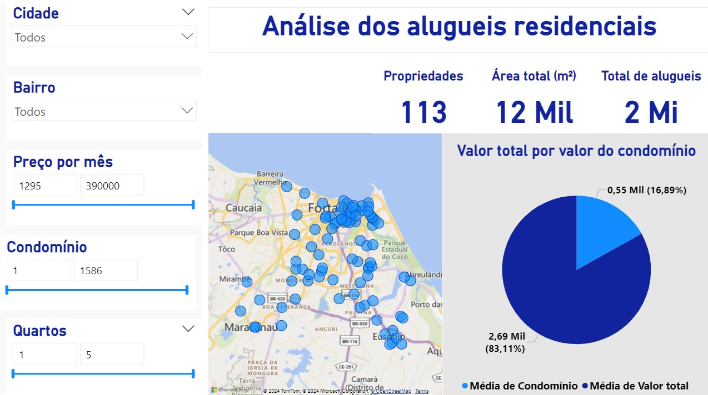

# Análise de Dados de Aluguéis

## Público Alvo

O público alvo desta análise são:

- Proprietários de imóveis que desejam entender melhor o mercado de aluguéis em Fortaleza.
- Inquilinos que procuram informações detalhadas sobre preços de aluguéis em diferentes bairros da cidade.
- Imobiliárias e corretores de imóveis que precisam de insights para oferecer melhores serviços a seus clientes.
- Pesquisadores e acadêmicos interessados em estudos de mercado imobiliário.

## Objetivo da Análise

O objetivo desta análise é fornecer uma visão abrangente do mercado de aluguéis em Fortaleza, Ceará. Pretendemos identificar tendências, padrões e fatores que influenciam os preços dos aluguéis em diferentes regiões da cidade. Com isso, esperamos oferecer informações valiosas que ajudem nossos públicos a tomar decisões informadas.

## Principais Perguntas a Serem Respondidas

1. Quais são os bairros mais caros e mais baratos para se alugar um imóvel em Fortaleza?
2. Quais são as características dos imóveis (como número de quartos, metragem, entre outros) que mais influenciam no preço do aluguel?
3. Variação do preço do aluguel x Quantidade de quartos x Região?
4. Existe alguma correlação entre os preços dos aluguéis e a proximidade de pontos de interesse (como escolas, hospitais, transporte público, etc.)?

## Estrutura do Projeto

- `data/`: Contém os datasets utilizados na análise.
- `notebooks/`: Jupyter notebooks com o código e a análise exploratória dos dados.
- `scripts/`: Scripts de processamento e visualização dos dados.
- `reports/`: Relatórios gerados a partir da análise.

## Ferramentas Utilizadas

- Python
  - Pandas
  - NumPy
- Jupyter Notebook

## Como Contribuir

1. Faça um fork deste repositório.
2. Crie uma branch com a nova feature (`git checkout -b feature/nova-feature`).
3. Faça o commit das suas alterações (`git commit -m 'Adiciona nova feature'`).
4. Faça o push para a branch (`git push origin feature/nova-feature`).
5. Abra um Pull Request.

## Contato

Para mais informações, entre em contato com [robsonsampaio90@gmail.com](mailto:robsonsampaio90@gmail.com).
